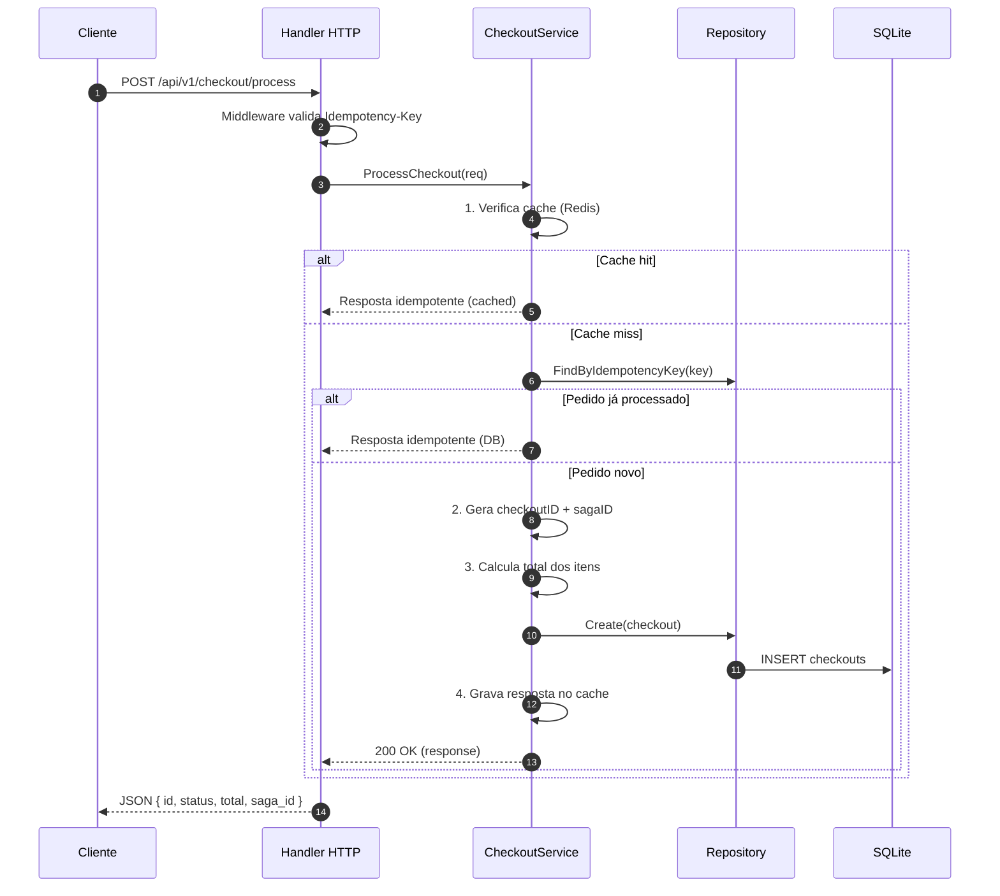
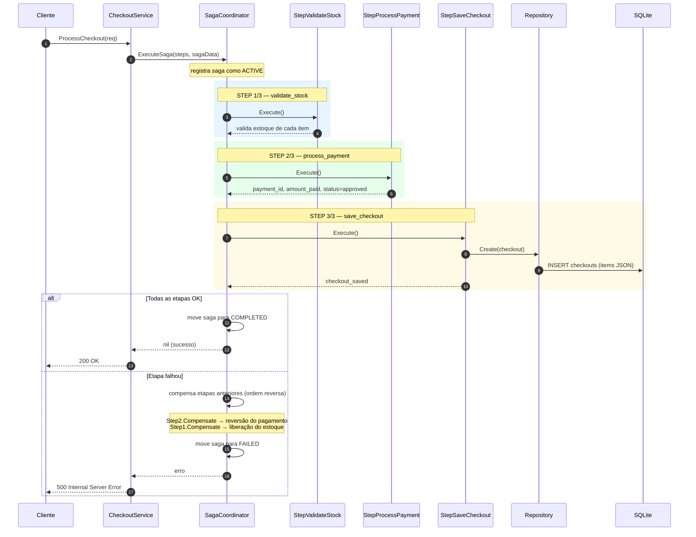
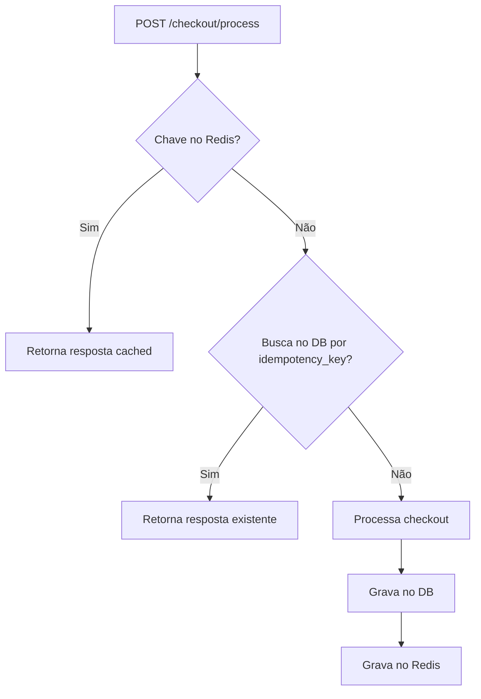

# checkout-go

Serviço de checkout em Go com suporte a **processamento tradicional** e **orquestração via padrão Saga**, garantindo consistência distribuída, idempotência e compensação de operações em caso de falha.

## Visão Geral

O serviço expõe uma API REST para processar pedidos de checkout. Cada requisição passa por validação de idempotência e, em seguida, é processada por um pipeline de etapas. Quando o processamento usa o **padrão Saga**, cada etapa é executada com uma contrapartida de compensação, permitindo reverter operações já concluídas caso uma etapa posterior falhe.

## Arquitetura

```
┌─────────────┐     ┌──────────────┐     ┌───────────────┐     ┌──────────────┐
│   Handler   │ ──▶ │    Service   │ ──▶ │ SagaCoordinator│ ──▶ │  Repository  │
│  (HTTP/Gin) │     │ (orquestra)  │     │ (coordenação) │     │    (GORM)    │
└─────────────┘     └──────────────┘     └───────────────┘     └──────────────┘
                          │  │                                        │
                          ▼  ▼                                        ▼
                     ┌──────────────┐                          ┌──────────────┐
                     │    Redis     │                          │   SQLite     │
                     │ (idempotência)│                         │ (checkouts)  │
                     └──────────────┘                          └──────────────┘
```

### Camadas

| Camada | Diretório | Responsabilidade |
|--------|-----------|------------------|
| Transporte | `internal/handlers` | Recebe HTTP, valida body, responde JSON |
| Middleware | `internal/middleware` | Valida e injeta o `Idempotency-Key` |
| Serviço | `internal/service` | Regras de negócio, orquestra o processamento |
| Saga | `internal/saga` | Coordenador e steps (execução + compensação) |
| Repositório | `internal/repository` | Persistência via GORM |
| Modelos | `internal/models` | Entidades e DTOs |

## Fluxo Sem Saga (Processamento Tradicional)

No modo tradicional, o checkout é processado de forma **sequencial e síncrona** sem mecanismo de compensação. Se qualquer etapa falhar, o fluxo é abortado e os dados já gravados permanecem.



### Passos (Sem Saga)

| # | Passo | Descrição |
|---|-------|-----------|
| 1 | **Idempotência** | Verifica cache Redis; se presente, retorna resposta armazenada |
| 2 | **Busca no DB** | Procura checkout pelo `idempotency_key`; se existir, reutiliza |
| 3 | **Geração de IDs** | Cria `checkoutID` (UUID) e `sagaID` (UUID) |
| 4 | **Cálculo do total** | Soma `price × quantity` de todos os itens |
| 5 | **Persistência** | Grava **uma única linha** com os itens em JSON |
| 6 | **Cache** | Armazena a resposta no Redis com TTL de 24h |

> **Característica-chave**: persistência de **1 pedido = 1 linha**, com `items` serializados como JSON — evita violação de constraint `UNIQUE` em `id_external`.

## Fluxo Com Saga (Orquestrado)

O padrão **Saga** coordena múltiplas etapas distribuídas. Cada step possui:

- `Execute(ctx, data)` — ação principal
- `Compensate(ctx, data)` — reversão da ação em caso de falha

Se a etapa `N` falhar, o coordenador executa `Compensate` de todas as etapas anteriores **em ordem reversa**, garantindo consistência.



### Steps do Saga

| Ordem | Step | Execute | Compensate |
|-------|------|---------|------------|
| 1 | **validate_stock** | Verifica `stock >= quantity` para cada item | Libera o estoque reservado |
| 2 | **process_payment** | Calcula total, gera `payment_id`, aprova pagamento | Reverte o pagamento (`reverse_status`) |
| 3 | **save_checkout** | Grava checkout no banco (1 linha, items JSON) | Marca checkout como removido |

### Estado do Saga

O `SagaCoordinator` mantém três mapas de estado:

| Mapa | Estado | Significado |
|------|--------|-------------|
| `activeSagas` | `processing` | Saga em execução |
| `completedSagas` | `completed` | Todas as etapas concluídas |
| `failedSagas` | `failed` | Alguma etapa falhou, compensações executadas |

> O estado fica **em memória**. Em produção, o estado do saga deve ser persistido (ex.: tabela própria, event sourcing) para recuperação entre instâncias.

## API

### `POST /api/v1/checkout/process`

Processa um checkout.

**Headers**

| Header | Obrigatório | Descrição |
|--------|:-----------:|-----------|
| `Idempotency-Key` | Sim | Chave de idempotência (letras, números e hífens) |

**Request Body**

```json
{
  "user_id": "user-123",
  "items": [
    { "product_id": "prod-001", "quantity": 2, "price": 29.90, "stock": 10 },
    { "product_id": "prod-002", "quantity": 1, "price": 59.90, "stock": 5 }
  ]
}
```

**Response 200**

```json
{
  "id": "a7fbd198-c8cf-4afd-ad1b-c522d0f60ccb",
  "status": "processed",
  "total": 119.70,
  "processe_in": "2026-08-14T14:55:37.515Z",
  "idempotency_key": "teste-123-abc",
  "saga_id": "e8d1e3aa-9b7f-4c8e-9f2a-1b2c3d4e5f60"
}
```

### `GET /api/v1/checkout/:id`

Busca checkout pelo `id_external`.

### `GET /api/v1/saga/:saga_id/status`

Consulta o estado de um saga (`processing`, `completed` ou `failed`).

```json
{ "saga_id": "e8d1e3aa-...", "status": "completed", "step": 3 }
```

### `GET /api/v1/health`

Health check.

```json
{ "status": "ok", "message": "service of checkout is running" }
```

## Idempotência

A idempotência é garantida em **três camadas**:

1. **Redis** — chave `idempotency:<key>` com resposta em cache (TTL 24h)
2. **Banco de dados** — lookup por `idempotency_key` (única por pedido)
3. **Constraint** — `uniqueIndex` em `id_external` e `idempotency_key`



## Erros

Todos os erros retornam mensagens em **inglês**.

| Status | Cenário |
|--------|---------|
| `400` | Body inválido ou `Idempotency-Key` ausente/formatada incorretamente |
| `404` | Checkout ou saga não encontrado |
| `500` | Falha no processamento (ex.: estoque insuficiente, erro no saga) |

## Como Executar

### Docker Compose

```bash
docker compose up --build
```

### Local

```bash
# Redis rodando em localhost:6379
go run main.go
```

Serviço disponível em `http://localhost:8082`.

> **Atenção**: se a estrutura do banco mudou (ex.: adição da coluna `items`), apague o arquivo `checkout.db` antes de subir para evitar dados legados.

## Testes

```bash
go test ./...
```

Cobertura atual:

- Repositório: lookup por `idempotency_key`
- Serviço: pedido multi-item cria **1 única linha**
- Serviço: cache corrompido cai no fallback do DB
- Serviço: idempotência (retry retorna o mesmo `id`)

## Tecnologias

- [Go](https://go.dev) 1.26
- [Gin](https://gin-gonic.com) — HTTP framework
- [GORM](https://gorm.io) + SQLite — persistência
- [Redis](https://redis.io) — cache de idempotência
- [go-redis](https://github.com/redis/go-redis) — client Redis
- [google/uuid](https://github.com/google/uuid) — geração de IDs
